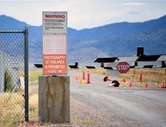

# Image-Steganographer
Embed encrypted messages in an image and then extract them back

Website: https://image-steganographer.netlify.app/

Application for Windows OS: https://github.com/InputBlackBoxOutput/Image-Steganographer/releases/tag/v1.0.0

## Things to note
| This cat can hold more than just the Tesseract  | Area 51 can hold on to a lot of secrets, add in your own |
|:---:|:---:|
|   |   |

## How to use?

### How to use the embedder to embed a message into an image?
1. Upload an image. Alternatively you can use a random image provided by the website
1. Enter the keyword
1. Enter the message
1. Press the embed & download button

### How to use the extractor to extract message from an image?
1. Upload the image containing the message
1. Enter the keyword
1. Press the extract button
1. When a success message is shown, see the section below for the message

### Made with lots of ⏱️, 📚 and ☕ by InputBlackBoxOutput
